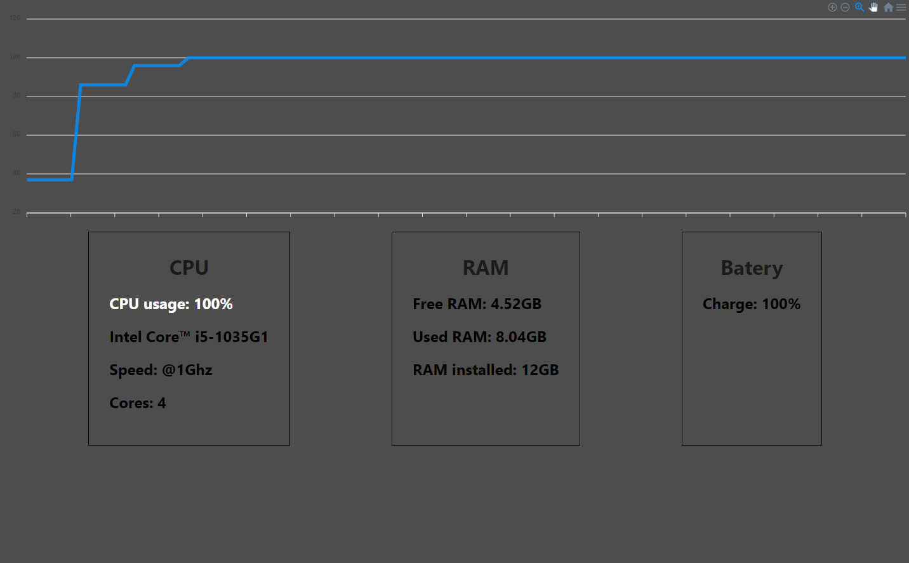

# SystemMonitorTool

## Project explanation

The project was thought to be a real time monitor of a computer equipment, in the case of the example the laptop that I used during the development, this provides in the webapp basic information about the use of the device such as battery, cpu and memory usage among others.

The operation is very simple the backend in node.js is executed in the computer that you want to monitor this will send the information to the WebApp in react.js through websockets.

## Sample image



## Installation

1. Clone the repository
```
git clone https://github.com/yassirH9/SystemMonitorTool
```

2. Open the "backend" folder and run the following command while the folder is located on the computer you want to monitor
```
npm install
```

3. Run the server
```
node app.js
```

4. Install the web app located in the "frontend" folder using the following command
```
npm install
```

5. Run the Web App server
```
npm start
```

## Made with 
- FrontEnd
  - [ReactJS](https://es.reactjs.org/)
- Backend
  - [NodeJS](https://nodejs.org/es/)
  - [SystemInformationIO](https://systeminformation.io/)
  - [WS](https://www.npmjs.com/package/ws#api-docs)
